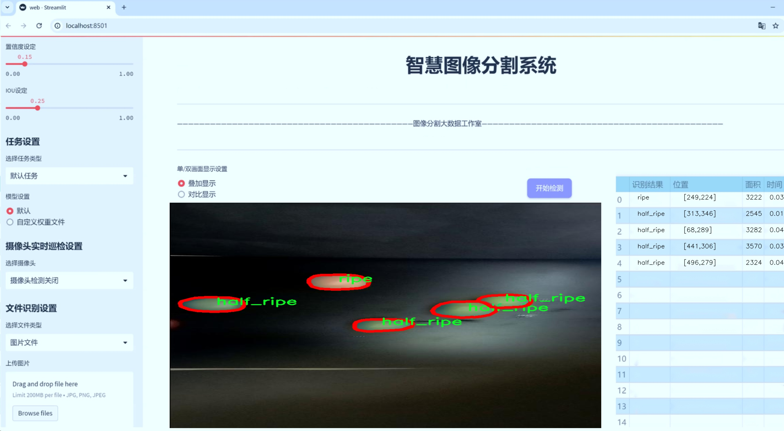
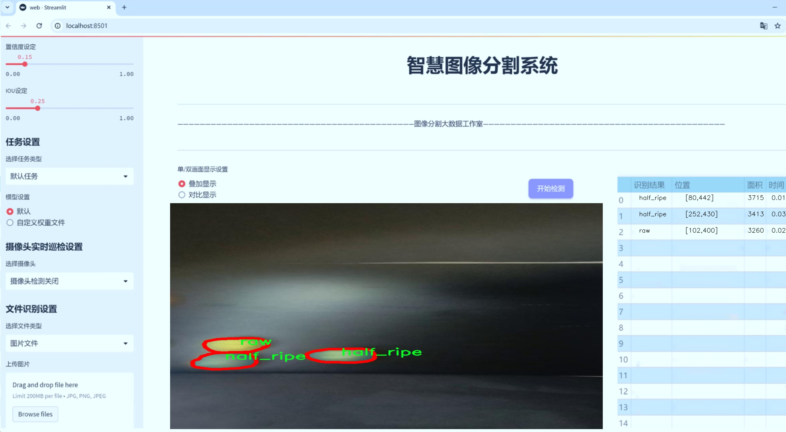
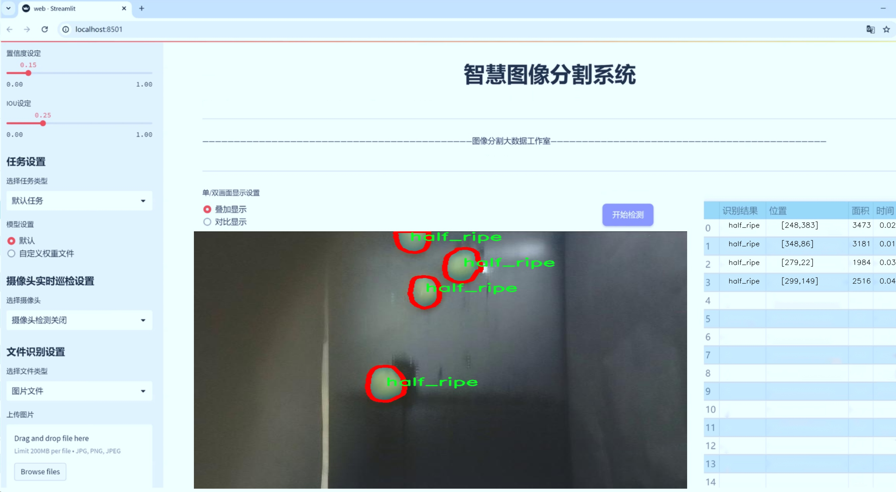
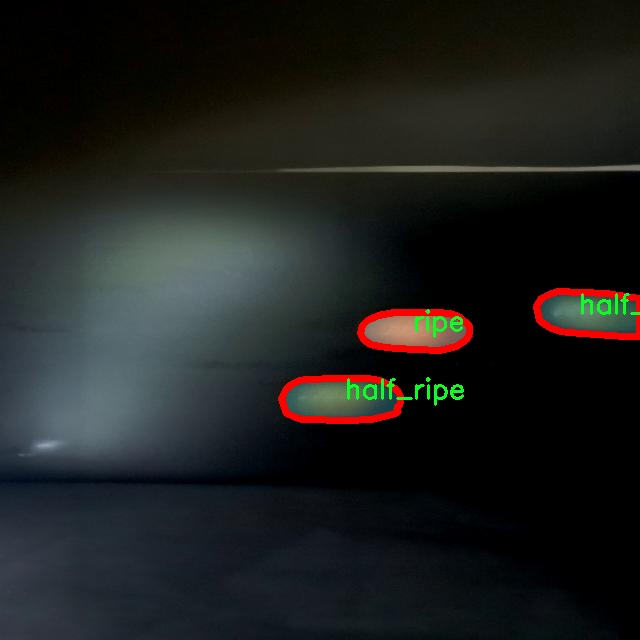
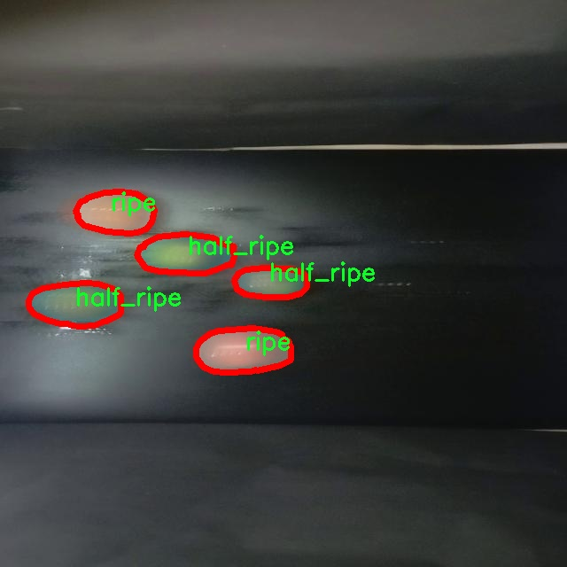
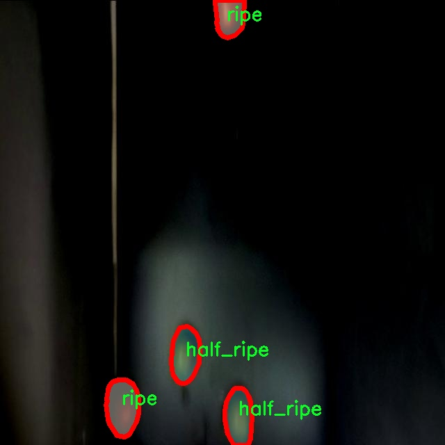
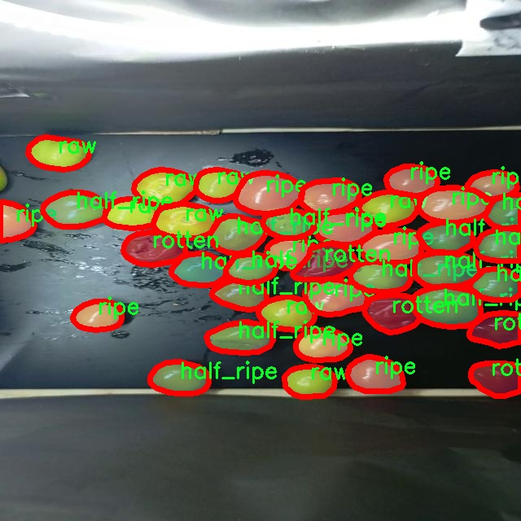
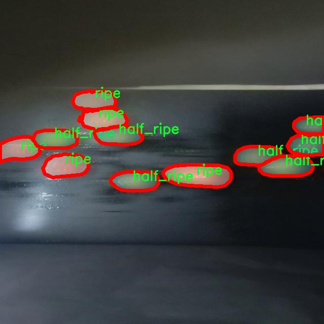

# 分拣线番茄分级缺陷识别图像分割系统源码＆数据集分享
 [yolov8-seg-timm＆yolov8-seg-dyhead-DCNV3等50+全套改进创新点发刊_一键训练教程_Web前端展示]

### 1.研究背景与意义

项目参考[ILSVRC ImageNet Large Scale Visual Recognition Challenge](https://gitee.com/YOLOv8_YOLOv11_Segmentation_Studio/projects)

项目来源[AAAI Global Al lnnovation Contest](https://kdocs.cn/l/cszuIiCKVNis)

研究背景与意义

随着全球农业生产的不断发展，农产品的质量与安全问题日益受到重视。番茄作为一种广泛种植和消费的果蔬，其品质直接影响到消费者的健康和市场的经济效益。因此，如何有效地对番茄进行分级和缺陷识别，成为了农业生产和供应链管理中的一个重要课题。传统的人工分拣方法不仅耗时耗力，而且容易受到人为因素的影响，导致分拣结果的不一致性和准确性不足。为了解决这一问题，基于计算机视觉和深度学习技术的自动化分拣系统逐渐成为研究的热点。

在众多深度学习模型中，YOLO（You Only Look Once）系列因其高效的实时目标检测能力而备受青睐。YOLOv8作为该系列的最新版本，结合了更先进的网络结构和算法优化，能够在保持高精度的同时，实现更快的处理速度。针对番茄分级缺陷识别的需求，改进YOLOv8模型以适应特定的应用场景，将为番茄的自动化分拣提供一种新的解决方案。通过对番茄图像进行实例分割，不仅可以识别出番茄的种类（如半熟、未熟、熟透和腐烂），还能够精确地定位缺陷区域，从而实现更为细致的分级处理。

本研究所使用的数据集包含1400张标注图像，涵盖了四种番茄类别，分别为半熟、未熟、熟透和腐烂。这一数据集的构建为模型的训练和验证提供了丰富的样本支持，确保了模型在不同番茄状态下的识别能力。通过对这些图像进行深入分析，研究者可以提取出影响番茄品质的关键特征，从而为后续的模型优化提供依据。此外，实例分割技术的应用使得模型不仅能够识别番茄的类别，还能对每个番茄的缺陷进行精确的区域划分，提升了分拣的准确性和效率。

在当前农业生产中，智能化、自动化的趋势愈发明显。通过引入改进YOLOv8的分拣线番茄分级缺陷识别图像分割系统，不仅能够提升番茄分拣的效率和准确性，还能够降低人工成本，提高生产的经济效益。这一系统的推广应用，能够为农产品的质量控制提供有力支持，推动农业现代化的发展。同时，研究成果也将为其他农产品的自动化分拣提供借鉴，具有广泛的应用前景和社会价值。

综上所述，基于改进YOLOv8的分拣线番茄分级缺陷识别图像分割系统的研究，不仅具有重要的理论意义，还具备显著的实践价值。通过对番茄分级缺陷的精准识别与分类，能够有效提升农业生产的智能化水平，为实现可持续农业发展贡献力量。

### 2.图片演示







##### 注意：由于此博客编辑较早，上面“2.图片演示”和“3.视频演示”展示的系统图片或者视频可能为老版本，新版本在老版本的基础上升级如下：（实际效果以升级的新版本为准）

  （1）适配了YOLOV8的“目标检测”模型和“实例分割”模型，通过加载相应的权重（.pt）文件即可自适应加载模型。

  （2）支持“图片识别”、“视频识别”、“摄像头实时识别”三种识别模式。

  （3）支持“图片识别”、“视频识别”、“摄像头实时识别”三种识别结果保存导出，解决手动导出（容易卡顿出现爆内存）存在的问题，识别完自动保存结果并导出到tempDir中。

  （4）支持Web前端系统中的标题、背景图等自定义修改，后面提供修改教程。

  另外本项目提供训练的数据集和训练教程,暂不提供权重文件（best.pt）,需要您按照教程进行训练后实现图片演示和Web前端界面演示的效果。

### 3.视频演示

[3.1 视频演示](https://www.bilibili.com/video/BV1yQDPYHESQ/)

### 4.数据集信息展示

##### 4.1 本项目数据集详细数据（类别数＆类别名）

nc: 4
names: ['half_ripe', 'raw', 'ripe', 'rotten']


##### 4.2 本项目数据集信息介绍

数据集信息展示

在本研究中，我们使用了名为“Tomato Defects”的数据集，以支持改进YOLOv8-seg模型在分拣线番茄分级缺陷识别中的图像分割任务。该数据集专门针对番茄的不同成熟度和缺陷状态进行了精心标注，旨在提高自动化分拣系统的准确性和效率。数据集包含四个主要类别，分别是“半熟”（half_ripe）、“生”（raw）、“熟”（ripe）和“腐烂”（rotten），这些类别涵盖了番茄在不同生长阶段及其质量状态的多样性。

在数据集的构建过程中，研究团队收集了大量的番茄图像，确保每个类别的样本数量充足且具有代表性。这些图像不仅包括了不同光照条件下的番茄，还涵盖了多种拍摄角度和背景，以增强模型的鲁棒性。通过对图像进行细致的标注，研究人员能够准确地为每个类别分配标签，使得YOLOv8-seg模型在训练过程中能够学习到每种状态的特征。

具体而言，“半熟”类别的图像展示了那些尚未完全成熟的番茄，通常呈现出绿色与红色的混合色调。这一类别的识别对于确保产品的最佳采摘时间至关重要，因为过早采摘可能影响番茄的口感和市场价值。接下来是“生”类别，包含了完全未成熟的番茄，通常呈现出鲜艳的绿色。这一类别的识别有助于分拣系统将不适合销售的番茄剔除，避免对消费者造成不良影响。

“熟”类别则代表了那些已经达到最佳食用状态的番茄，通常呈现出鲜艳的红色。该类别的准确识别不仅能够提高产品的市场竞争力，还能增强消费者的满意度。最后，“腐烂”类别则包含了那些由于储存不当或其他原因而变质的番茄，通常表现出褐色或黑色的斑点。识别这一类别对于减少食品浪费和维护品牌形象至关重要。

通过对“Tomato Defects”数据集的深入分析和处理，我们期望能够显著提升YOLOv8-seg模型在番茄分级和缺陷识别任务中的表现。数据集的多样性和丰富性为模型提供了充足的训练样本，使其能够在实际应用中更好地适应不同的环境和条件。此外，数据集的精确标注为模型的训练提供了坚实的基础，确保了模型能够有效地学习到各个类别的特征。

总之，“Tomato Defects”数据集不仅为本研究提供了必要的训练数据，也为未来的研究和应用奠定了基础。通过不断优化和改进图像分割系统，我们期望能够实现更高效的番茄分拣和质量控制，为农业生产和食品供应链的智能化发展贡献力量。











### 5.全套项目环境部署视频教程（零基础手把手教学）

[5.1 环境部署教程链接（零基础手把手教学）](https://www.bilibili.com/video/BV1jG4Ve4E9t/?vd_source=bc9aec86d164b67a7004b996143742dc)


[5.2 安装Python虚拟环境创建和依赖库安装视频教程链接（零基础手把手教学）](https://www.bilibili.com/video/BV1nA4VeYEze/?vd_source=bc9aec86d164b67a7004b996143742dc)

### 6.手把手YOLOV8-seg训练视频教程（零基础小白有手就能学会）

[6.1 手把手YOLOV8-seg训练视频教程（零基础小白有手就能学会）](https://www.bilibili.com/video/BV1cA4VeYETe/?vd_source=bc9aec86d164b67a7004b996143742dc)


按照上面的训练视频教程链接加载项目提供的数据集，运行train.py即可开始训练



     Epoch   gpu_mem       box       obj       cls    labels  img_size
     1/200     0G   0.01576   0.01955  0.007536        22      1280: 100%|██████████| 849/849 [14:42<00:00,  1.04s/it]
               Class     Images     Labels          P          R     mAP@.5 mAP@.5:.95: 100%|██████████| 213/213 [01:14<00:00,  2.87it/s]
                 all       3395      17314      0.994      0.957      0.0957      0.0843

     Epoch   gpu_mem       box       obj       cls    labels  img_size
     2/200     0G   0.01578   0.01923  0.007006        22      1280: 100%|██████████| 849/849 [14:44<00:00,  1.04s/it]
               Class     Images     Labels          P          R     mAP@.5 mAP@.5:.95: 100%|██████████| 213/213 [01:12<00:00,  2.95it/s]
                 all       3395      17314      0.996      0.956      0.0957      0.0845

     Epoch   gpu_mem       box       obj       cls    labels  img_size
     3/200     0G   0.01561    0.0191  0.006895        27      1280: 100%|██████████| 849/849 [10:56<00:00,  1.29it/s]
               Class     Images     Labels          P          R     mAP@.5 mAP@.5:.95: 100%|███████   | 187/213 [00:52<00:00,  4.04it/s]
                 all       3395      17314      0.996      0.957      0.0957      0.0845


### 7.50+种全套YOLOV8-seg创新点代码加载调参视频教程（一键加载写好的改进模型的配置文件）

[7.1 50+种全套YOLOV8-seg创新点代码加载调参视频教程（一键加载写好的改进模型的配置文件）](https://www.bilibili.com/video/BV1Hw4VePEXv/?vd_source=bc9aec86d164b67a7004b996143742dc)

### 8.YOLOV8-seg图像分割算法原理

原始YOLOv8-seg算法原理

YOLOv8-seg是YOLO系列模型中的最新版本，专注于目标检测与分割任务。该算法在YOLOv8的基础上进行了扩展，旨在提高图像分割的精度和效率。YOLOv8-seg的设计理念是将目标检测与实例分割相结合，使得模型不仅能够识别目标的位置，还能精确地分割出目标的轮廓。这一创新使得YOLOv8-seg在处理复杂场景时表现出色，尤其是在需要对多个目标进行精细化处理的应用中。

YOLOv8-seg的架构由输入层、主干网络、颈部网络和头部网络四个主要部分构成。输入层负责接收图像数据，并将其缩放到指定的输入尺寸，以满足模型的要求。主干网络是YOLOv8-seg的核心部分，采用了一系列卷积操作来提取图像特征。与传统的YOLO模型相比，YOLOv8-seg在主干网络中引入了更为先进的特征提取模块，如C2f块和SPPFl块。C2f块通过跨层连接的方式增强了模型的梯度流动，从而提高了特征提取的效率和准确性。而SPPFl块则通过多尺度池化操作，进一步提升了模型对不同尺度特征的处理能力，使得模型在面对复杂场景时能够更好地捕捉到目标的细节信息。

在特征提取完成后，颈部网络通过FPNS（Feature Pyramid Network）和PAN（Path Aggregation Network）结构对不同尺度的特征图进行融合。这一过程是YOLOv8-seg的关键步骤之一，它确保了模型能够有效地整合来自不同层次的特征信息，从而提高目标检测和分割的精度。颈部网络的设计旨在克服传统模型在处理多尺度目标时的局限性，使得YOLOv8-seg能够在各种场景下都表现出色。

头部网络是YOLOv8-seg的输出部分，采用了解耦的检测头结构。该结构通过两个并行的卷积分支分别计算目标的回归和分类损失，使得模型在训练过程中能够更好地优化目标检测和分割的性能。与传统的YOLO模型不同，YOLOv8-seg的头部网络还引入了分割分支，专门用于处理实例分割任务。这一创新使得YOLOv8-seg不仅能够识别目标的位置，还能精确地分割出目标的轮廓，极大地提高了模型在复杂场景下的应用能力。

在模型设置方面，YOLOv8-seg提供了多种参数配置选项，以便用户根据具体任务需求进行调整。通过设置depth_factor、width_factor和ratio等参数，用户可以灵活地调整模型的深度和宽度，从而实现对模型性能的优化。深度和宽度的调整使得YOLOv8-seg能够在不同的硬件平台上高效运行，同时也为用户提供了更大的灵活性，以适应各种应用场景。

总的来说，YOLOv8-seg算法通过结合目标检测与实例分割的能力，极大地提升了图像处理的精度和效率。其独特的网络结构设计和灵活的参数配置，使得该算法在实际应用中展现出了强大的适应性和优越的性能。随着YOLOv8-seg的不断发展与完善，预计将在更多领域中得到广泛应用，为计算机视觉技术的进步做出重要贡献。


### 9.系统功能展示（检测对象为举例，实际内容以本项目数据集为准）

图9.1.系统支持检测结果表格显示

  图9.2.系统支持置信度和IOU阈值手动调节

  图9.3.系统支持自定义加载权重文件best.pt(需要你通过步骤5中训练获得)

  图9.4.系统支持摄像头实时识别

  图9.5.系统支持图片识别

  图9.6.系统支持视频识别

  图9.7.系统支持识别结果文件自动保存

  图9.8.系统支持Excel导出检测结果数据


### 10.50+种全套YOLOV8-seg创新点原理讲解（非科班也可以轻松写刊发刊，V11版本正在科研待更新）

#### 10.1 由于篇幅限制，每个创新点的具体原理讲解就不一一展开，具体见下列网址中的创新点对应子项目的技术原理博客网址【Blog】：


[10.1 50+种全套YOLOV8-seg创新点原理讲解链接](https://gitee.com/qunmasj/good)

#### 10.2 部分改进模块原理讲解(完整的改进原理见上图和技术博客链接)【如果此小节的图加载失败可以通过CSDN或者Github搜索该博客的标题访问原始博客，原始博客图片显示正常】
### YOLOv8算法原理
YOLOv8算法由Glenn-Jocher 提出，是跟YOLOv3算法、YOLOv5算法一脉相承的，主要的改进点如下:
(1)数据预处理。YOLOv8的数据预处理依旧采用YOLOv5的策略,在训练时，主要采用包括马赛克增强(Mosaic)、混合增强(Mixup)、空间扰动(randomperspective)以及颜色扰动(HSV augment)四个增强手段。
(2)骨干网络结构。YOLOv8的骨干网络结构可从YOLOv5略见一斑，YOLOv5的主干网络的架构规律十分清晰，总体来看就是每用一层步长为2的3×3卷积去降采样特征图，接一个C3模块来进一步强化其中的特征，且C3的基本深度参数分别为“3/6/9/3”，其会根据不同规模的模型的来做相应的缩放。在的YOLOv8中，大体上也还是继承了这一特点，原先的C3模块均被替换成了新的C2f模块，C2f 模块加入更多的分支，丰富梯度回传时的支流。下面展示了YOLOv8的C2f模块和YOLOv5的C3模块，其网络结构图所示。


(3)FPN-PAN结构。YOLOv8仍采用FPN+PAN结构来构建YOLO的特征金字塔，使多尺度信息之间进行充分的融合。除了FPN-PAN里面的C3模块被替换为C2f模块外，其余部分与YOLOv5的FPN-PAN结构基本一致。
(4)Detection head结构。从 YOLOv3到 YOLOv5，其检测头一直都是“耦合”(Coupled)的,即使用一层卷积同时完成分类和定位两个任务，直到YOLOX的问世， YOLO系列才第一次换装“解耦头”(Decoupled Head)。YOLOv8也同样也采用了解耦头的结构，两条并行的分支分别取提取类别特征和位置特征，然后各用一层1x1卷积完成分类和定位任务。YOLOv8整体的网络结构由图所示。


(5)标签分配策略。尽管YOLOv5设计了自动聚类候选框的一些功能，但是聚类候选框是依赖于数据集的。若数据集不够充分，无法较为准确地反映数据本身的分布特征，聚类出来的候选框也会与真实物体尺寸比例悬殊过大。YOLOv8没有采用候选框策略，所以解决的问题就是正负样本匹配的多尺度分配。不同于YOLOX所使用的 SimOTA，YOLOv8在标签分配问题上采用了和YOLOv6相同的TOOD策略，是一种动态标签分配策略。YOLOv8只用到了targetboze。和target scores，未含是否有物体预测，故 YOLOv8的损失就主要包括两大部分∶类别损失和位置损失。对于YOLOv8，其分类损失为VFLLoss(Varifocal Loss)，其回归损失为CIoU Loss 与 DFL Loss 的形式。
其中 Varifocal Loss定义如下:


其中p为预测的类别得分，p ∈ [0.1]。q为预测的目标分数(若为真实类别，则q为预测和真值的 loU;若为其他类别。q为0 )。VFL Loss使用不对称参数来对正负样本进行加权，通过只对负样本进行衰减，达到不对等的处理前景和背景对损失的贡献。对正样本，使用q进行了加权，如果正样本的GTiou很高时,则对损失的贡献更大一些，可以让网络聚焦于那些高质量的样本上，即训练高质量的正例对AP的提升比低质量的更大一些。对负样本，使用p进行了降权，降低了负例对损失的贡献，因负样本的预测p在取次幂后会变得更小，这样就能够降低负样本对损失的整体贡献。

### 动态蛇形卷积Dynamic Snake Convolution

参考论文： 2307.08388.pdf (arxiv.org)

血管、道路等拓扑管状结构的精确分割在各个领域都至关重要，确保下游任务的准确性和效率。 然而，许多因素使任务变得复杂，包括薄的局部结构和可变的全局形态。在这项工作中，我们注意到管状结构的特殊性，并利用这些知识来指导我们的 DSCNet 在三个阶段同时增强感知：特征提取、特征融合、 和损失约束。 首先，我们提出了一种动态蛇卷积，通过自适应地关注细长和曲折的局部结构来准确捕获管状结构的特征。 随后，我们提出了一种多视图特征融合策略，以补充特征融合过程中多角度对特征的关注，确保保留来自不同全局形态的重要信息。 最后，提出了一种基于持久同源性的连续性约束损失函数，以更好地约束分割的拓扑连续性。 2D 和 3D 数据集上的实验表明，与多种方法相比，我们的 DSCNet 在管状结构分割任务上提供了更好的准确性和连续性。 我们的代码是公开的。 
主要的挑战源于细长微弱的局部结构特征与复杂多变的全局形态特征。本文关注到管状结构细长连续的特点，并利用这一信息在神经网络以下三个阶段同时增强感知：特征提取、特征融合和损失约束。分别设计了动态蛇形卷积（Dynamic Snake Convolution），多视角特征融合策略与连续性拓扑约束损失。 

我们希望卷积核一方面能够自由地贴合结构学习特征，另一方面能够在约束条件下不偏离目标结构太远。在观察管状结构的细长连续的特征后，脑海里想到了一个动物——蛇。我们希望卷积核能够像蛇一样动态地扭动，来贴合目标的结构。

我们希望卷积核一方面能够自由地贴合结构学习特征，另一方面能够在约束条件下不偏离目标结构太远。在观察管状结构的细长连续的特征后，脑海里想到了一个动物——蛇。我们希望卷积核能够像蛇一样动态地扭动，来贴合目标的结构。


### DCNV2融入YOLOv8
DCN和DCNv2（可变性卷积）
网上关于两篇文章的详细描述已经很多了，我这里具体的细节就不多讲了，只说一下其中实现起来比较困惑的点。（黑体字会讲解）

DCNv1解决的问题就是我们常规的图像增强，仿射变换（线性变换加平移）不能解决的多种形式目标变换的几何变换的问题。如下图所示。

可变性卷积的思想很简单，就是讲原来固定形状的卷积核变成可变的。如下图所示：


首先来看普通卷积，以3x3卷积为例对于每个输出y(p0)，都要从x上采样9个位置，这9个位置都在中心位置x(p0)向四周扩散得到的gird形状上，(-1,-1)代表x(p0)的左上角，(1,1)代表x(p0)的右下角，其他类似。

用公式表示如下：


可变性卷积Deformable Conv操作并没有改变卷积的计算操作，而是在卷积操作的作用区域上，加入了一个可学习的参数∆pn。同样对于每个输出y(p0)，都要从x上采样9个位置，这9个位置是中心位置x(p0)向四周扩散得到的，但是多了 ∆pn，允许采样点扩散成非gird形状。


偏移量是通过对原始特征层进行卷积得到的。比如输入特征层是w×h×c，先对输入的特征层进行卷积操作，得到w×h×2c的offset field。这里的w和h和原始特征层的w和h是一致的，offset field里面的值是输入特征层对应位置的偏移量，偏移量有x和y两个方向，所以offset field的channel数是2c。offset field里的偏移量是卷积得到的，可能是浮点数，所以接下来需要通过双向性插值计算偏移位置的特征值。在偏移量的学习中，梯度是通过双线性插值来进行反向传播的。
看到这里是不是还是有点迷茫呢？那到底程序上面怎么实现呢？


事实上由上面的公式我们可以看得出来∆pn这个偏移量是加在原像素点上的，但是我们怎么样从代码上对原像素点加这个量呢？其实很简单，就是用一个普通的卷积核去跟输入图片（一般是输入的feature_map）卷积就可以了卷积核的数量是2N也就是23*3==18（前9个通道是x方向的偏移量，后9个是y方向的偏移量），然后把这个卷积的结果与正常卷积的结果进行相加就可以了。
然后又有了第二个问题，怎么样反向传播呢？为什么会有这个问题呢？因为求出来的偏移量+正常卷积输出的结果往往是一个浮点数，浮点数是无法对应到原图的像素点的，所以自然就想到了双线性差值的方法求出浮点数对应的浮点像素点。


#### DCN v2
对于positive的样本来说，采样的特征应该focus在RoI内，如果特征中包含了过多超出RoI的内容，那么结果会受到影响和干扰。而negative样本则恰恰相反，引入一些超出RoI的特征有助于帮助网络判别这个区域是背景区域。

DCNv1引入了可变形卷积，能更好的适应目标的几何变换。但是v1可视化结果显示其感受野对应位置超出了目标范围，导致特征不受图像内容影响（理想情况是所有的对应位置分布在目标范围以内）。

为了解决该问题：提出v2, 主要有

1、扩展可变形卷积，增强建模能力
2、提出了特征模拟方案指导网络培训：feature mimicking scheme

上面这段话是什么意思呢，通俗来讲就是，我们的可变性卷积的区域大于目标所在区域，所以这时候就会对非目标区域进行错误识别。

所以自然能想到的解决方案就是加入权重项进行惩罚。（至于这个实现起来就比较简单了，直接初始化一个权重然后乘(input+offsets)就可以了）


可调节的RoIpooling也是类似的，公式如下：


### 11.项目核心源码讲解（再也不用担心看不懂代码逻辑）

#### 11.1 ultralytics\utils\callbacks\wb.py

以下是经过精简和注释的核心代码部分，主要保留了与模型训练过程中的日志记录和可视化相关的功能。

```python
# 导入必要的库
from ultralytics.utils import SETTINGS, TESTS_RUNNING
from ultralytics.utils.torch_utils import model_info_for_loggers

try:
    # 确保没有在运行测试
    assert not TESTS_RUNNING  
    # 确保WandB集成已启用
    assert SETTINGS['wandb'] is True  
    import wandb as wb

    # 确保WandB包已正确导入
    assert hasattr(wb, '__version__')  

    import numpy as np
    import pandas as pd

    # 存储已处理的图表
    _processed_plots = {}

except (ImportError, AssertionError):
    wb = None  # 如果导入失败，则将wb设置为None


def _custom_table(x, y, classes, title='Precision Recall Curve', x_title='Recall', y_title='Precision'):
    """
    创建并记录自定义的精确度-召回率曲线可视化。
    
    Args:
        x (List): x轴的值，长度为N。
        y (List): y轴的值，长度为N。
        classes (List): 每个点的类别标签，长度为N。
        title (str): 图表标题，默认为'Precision Recall Curve'。
        x_title (str): x轴标签，默认为'Recall'。
        y_title (str): y轴标签，默认为'Precision'。

    Returns:
        (wandb.Object): 适合记录的wandb对象，展示自定义的可视化。
    """
    df = pd.DataFrame({'class': classes, 'y': y, 'x': x}).round(3)  # 创建数据框
    fields = {'x': 'x', 'y': 'y', 'class': 'class'}
    string_fields = {'title': title, 'x-axis-title': x_title, 'y-axis-title': y_title}
    return wb.plot_table('wandb/area-under-curve/v0',
                         wb.Table(dataframe=df),
                         fields=fields,
                         string_fields=string_fields)


def _plot_curve(x, y, names=None, id='precision-recall', title='Precision Recall Curve', x_title='Recall', y_title='Precision', num_x=100, only_mean=False):
    """
    记录指标曲线可视化。
    
    Args:
        x (np.ndarray): x轴数据点，长度为N。
        y (np.ndarray): y轴数据点，形状为CxN，C为类别数。
        names (list): 类别名称，长度为C。
        id (str): 记录数据的唯一标识符，默认为'precision-recall'。
        title (str): 可视化图表的标题，默认为'Precision Recall Curve'。
        x_title (str): x轴标签，默认为'Recall'。
        y_title (str): y轴标签，默认为'Precision'。
        num_x (int): 可视化的插值数据点数量，默认为100。
        only_mean (bool): 是否仅绘制均值曲线的标志，默认为True。
    """
    if names is None:
        names = []  # 如果没有提供类别名称，则初始化为空列表
    x_new = np.linspace(x[0], x[-1], num_x).round(5)  # 创建新的x值

    # 创建用于记录的数组
    x_log = x_new.tolist()
    y_log = np.interp(x_new, x, np.mean(y, axis=0)).round(3).tolist()  # 计算均值并插值

    if only_mean:
        # 仅记录均值曲线
        table = wb.Table(data=list(zip(x_log, y_log)), columns=[x_title, y_title])
        wb.run.log({title: wb.plot.line(table, x_title, y_title, title=title)})
    else:
        # 记录每个类别的曲线
        classes = ['mean'] * len(x_log)
        for i, yi in enumerate(y):
            x_log.extend(x_new)  # 添加新的x值
            y_log.extend(np.interp(x_new, x, yi))  # 将y插值到新的x
            classes.extend([names[i]] * len(x_new))  # 添加类别名称
        wb.log({id: _custom_table(x_log, y_log, classes, title, x_title, y_title)}, commit=False)


def on_fit_epoch_end(trainer):
    """在每个训练周期结束时记录训练指标和模型信息。"""
    wb.run.log(trainer.metrics, step=trainer.epoch + 1)  # 记录训练指标
    _log_plots(trainer.plots, step=trainer.epoch + 1)  # 记录图表
    if trainer.epoch == 0:
        wb.run.log(model_info_for_loggers(trainer), step=trainer.epoch + 1)  # 记录模型信息


def on_train_end(trainer):
    """在训练结束时保存最佳模型作为artifact。"""
    _log_plots(trainer.validator.plots, step=trainer.epoch + 1)  # 记录验证器图表
    art = wb.Artifact(type='model', name=f'run_{wb.run.id}_model')  # 创建artifact
    if trainer.best.exists():
        art.add_file(trainer.best)  # 添加最佳模型文件
        wb.run.log_artifact(art, aliases=['best'])  # 记录artifact
    wb.run.finish()  # 结束WandB运行


# 定义回调函数
callbacks = {
    'on_fit_epoch_end': on_fit_epoch_end,
    'on_train_end': on_train_end
} if wb else {}
```

### 代码说明：
1. **WandB集成**：代码首先确保WandB库可用，并进行必要的初始化。
2. **可视化函数**：
   - `_custom_table`：创建自定义的精确度-召回率曲线并记录到WandB。
   - `_plot_curve`：生成并记录指标曲线，支持绘制均值或各类别的曲线。
3. **训练回调**：
   - `on_fit_epoch_end`：在每个训练周期结束时记录指标和模型信息。
   - `on_train_end`：在训练结束时保存最佳模型并记录相关图表。

这些核心部分负责模型训练过程中的可视化和日志记录，帮助开发者监控模型性能。

这个文件是Ultralytics YOLO项目中的一个回调模块，主要用于与Weights & Biases（wandb）进行集成，以便在训练过程中记录和可视化模型的性能指标。文件首先导入了一些必要的库和模块，包括设置和测试状态的检查，以及wandb库的导入。通过一些断言，确保在测试运行时不记录日志，并且确认wandb集成已启用。

文件中定义了几个函数，首先是`_custom_table`，该函数用于创建并记录一个自定义的精确度-召回曲线（Precision-Recall Curve）的可视化。它接受x轴和y轴的数据点、类别标签以及图表的标题和轴标签，并返回一个适合wandb记录的对象。这个函数使用Pandas库创建一个数据框，并将其转换为wandb可以处理的格式。

接下来是`_plot_curve`函数，它用于记录一个度量曲线的可视化。该函数根据输入的数据生成一个曲线，并可以选择记录所有类别的数据或仅记录平均值。它会创建新的x值，并通过插值计算y值，然后将这些数据记录到wandb中。该函数同样调用了`_custom_table`来生成可视化。

`_log_plots`函数用于记录输入字典中的图表，如果在指定的步骤中尚未记录过这些图表，它会将其记录到wandb中。

文件中还定义了一些回调函数，这些函数在训练的不同阶段被调用。`on_pretrain_routine_start`函数在预训练例程开始时初始化wandb项目；`on_fit_epoch_end`函数在每个训练周期结束时记录训练指标和模型信息；`on_train_epoch_end`函数在每个训练周期结束时记录损失和学习率，并在特定周期记录图表；`on_train_end`函数在训练结束时保存最佳模型并记录验证指标的曲线。

最后，文件将这些回调函数组织成一个字典，便于在训练过程中调用。整个模块的设计旨在通过wandb提供的功能，帮助用户更好地监控和分析模型的训练过程。

#### 11.2 ultralytics\models\sam\build.py

以下是经过简化和注释的核心代码部分：

```python
import torch
from functools import partial
from ultralytics.utils.downloads import attempt_download_asset
from .modules.decoders import MaskDecoder
from .modules.encoders import ImageEncoderViT, PromptEncoder
from .modules.sam import Sam
from .modules.tiny_encoder import TinyViT
from .modules.transformer import TwoWayTransformer

def _build_sam(encoder_embed_dim,
               encoder_depth,
               encoder_num_heads,
               encoder_global_attn_indexes,
               checkpoint=None,
               mobile_sam=False):
    """构建指定的SAM模型架构。"""
    
    # 定义提示嵌入维度和图像尺寸
    prompt_embed_dim = 256
    image_size = 1024
    vit_patch_size = 16
    image_embedding_size = image_size // vit_patch_size  # 计算图像嵌入尺寸

    # 根据是否为移动SAM选择不同的图像编码器
    image_encoder = (TinyViT(
        img_size=1024,
        in_chans=3,
        num_classes=1000,
        embed_dims=encoder_embed_dim,
        depths=encoder_depth,
        num_heads=encoder_num_heads,
        window_sizes=[7, 7, 14, 7],
        mlp_ratio=4.0,
        drop_rate=0.0,
        drop_path_rate=0.0,
        use_checkpoint=False,
        mbconv_expand_ratio=4.0,
        local_conv_size=3,
        layer_lr_decay=0.8,
    ) if mobile_sam else ImageEncoderViT(
        depth=encoder_depth,
        embed_dim=encoder_embed_dim,
        img_size=image_size,
        mlp_ratio=4,
        norm_layer=partial(torch.nn.LayerNorm, eps=1e-6),
        num_heads=encoder_num_heads,
        patch_size=vit_patch_size,
        qkv_bias=True,
        use_rel_pos=True,
        global_attn_indexes=encoder_global_attn_indexes,
        window_size=14,
        out_chans=prompt_embed_dim,
    ))

    # 创建SAM模型
    sam = Sam(
        image_encoder=image_encoder,
        prompt_encoder=PromptEncoder(
            embed_dim=prompt_embed_dim,
            image_embedding_size=(image_embedding_size, image_embedding_size),
            input_image_size=(image_size, image_size),
            mask_in_chans=16,
        ),
        mask_decoder=MaskDecoder(
            num_multimask_outputs=3,
            transformer=TwoWayTransformer(
                depth=2,
                embedding_dim=prompt_embed_dim,
                mlp_dim=2048,
                num_heads=8,
            ),
            transformer_dim=prompt_embed_dim,
            iou_head_depth=3,
            iou_head_hidden_dim=256,
        ),
        pixel_mean=[123.675, 116.28, 103.53],  # 图像像素均值
        pixel_std=[58.395, 57.12, 57.375],      # 图像像素标准差
    )

    # 如果提供了检查点，则加载模型权重
    if checkpoint is not None:
        checkpoint = attempt_download_asset(checkpoint)  # 尝试下载检查点
        with open(checkpoint, 'rb') as f:
            state_dict = torch.load(f)  # 加载模型状态字典
        sam.load_state_dict(state_dict)  # 加载权重到模型中

    sam.eval()  # 设置模型为评估模式
    return sam  # 返回构建的SAM模型

def build_sam(ckpt='sam_b.pt'):
    """根据指定的检查点构建SAM模型。"""
    model_builder = None
    ckpt = str(ckpt)  # 将检查点转换为字符串以支持Path类型
    for k in sam_model_map.keys():
        if ckpt.endswith(k):
            model_builder = sam_model_map.get(k)  # 获取对应的模型构建函数

    if not model_builder:
        raise FileNotFoundError(f'{ckpt} 不是支持的SAM模型。可用模型有: \n {sam_model_map.keys()}')

    return model_builder(ckpt)  # 调用模型构建函数并返回模型
```

### 代码说明：
1. **导入模块**：导入必要的库和模块，包括PyTorch和模型组件。
2. **_build_sam函数**：该函数用于构建SAM模型，接收多个参数来定义模型的结构和特性。
   - **参数**：
     - `encoder_embed_dim`：编码器的嵌入维度。
     - `encoder_depth`：编码器的深度。
     - `encoder_num_heads`：编码器的头数。
     - `encoder_global_attn_indexes`：全局注意力索引。
     - `checkpoint`：可选的模型检查点，用于加载预训练权重。
     - `mobile_sam`：布尔值，指示是否构建移动版本的SAM。
   - **模型构建**：根据输入参数选择合适的图像编码器（TinyViT或ImageEncoderViT），然后构建SAM模型，包括图像编码器、提示编码器和掩码解码器。
   - **加载权重**：如果提供了检查点，则尝试下载并加载模型权重。
3. **build_sam函数**：根据给定的检查点名称构建SAM模型，确保所提供的检查点是有效的。

这个程序文件主要用于构建和返回不同版本的“Segment Anything Model”（SAM），这是一个用于图像分割的深度学习模型。程序首先导入了一些必要的库和模块，包括PyTorch和一些自定义的模块，如解码器、编码器和变换器。

文件中定义了多个构建函数，每个函数负责创建一个特定大小的SAM模型，包括高（h）、大（l）、小（b）和移动版（Mobile-SAM）。这些函数调用了一个内部的私有函数`_build_sam`，该函数根据传入的参数配置模型的各个组件，如编码器的嵌入维度、深度、头数和全局注意力索引等。

`_build_sam`函数的实现较为复杂。它首先定义了一些常量，如提示嵌入维度、图像大小和补丁大小。然后根据是否为移动版模型选择不同的图像编码器。对于移动版，使用的是`TinyViT`，而对于其他版本，则使用`ImageEncoderViT`。这两个编码器都负责将输入图像转换为特征表示。

接下来，SAM模型的主要组件被实例化，包括图像编码器、提示编码器和掩码解码器。提示编码器负责处理输入的提示信息，而掩码解码器则用于生成分割掩码，使用了一个双向变换器来处理特征。

如果提供了检查点（checkpoint），程序会尝试下载并加载模型的预训练权重，以便于后续的推理。加载权重后，模型会被设置为评估模式。

最后，程序定义了一个映射字典`samm_model_map`，将不同的模型文件名映射到相应的构建函数。`build_sam`函数则根据给定的检查点名称调用相应的构建函数，构建并返回所需的SAM模型。如果检查点不在支持的模型列表中，程序会抛出一个文件未找到的异常。

总的来说，这个文件提供了一种灵活的方式来构建不同配置的SAM模型，并且支持加载预训练权重，以便于在实际应用中进行图像分割任务。

#### 11.3 ultralytics\trackers\utils\gmc.py

以下是代码中最核心的部分，并附上详细的中文注释：

```python
import cv2
import numpy as np

class GMC:
    """
    通用运动补偿 (GMC) 类，用于视频帧中的跟踪和物体检测。
    该类提供了基于多种跟踪算法（包括 ORB、SIFT、ECC 和稀疏光流）的物体跟踪和检测方法。
    """

    def __init__(self, method='sparseOptFlow', downscale=2):
        """初始化 GMC 对象，指定跟踪方法和缩放因子。"""
        self.method = method  # 跟踪方法
        self.downscale = max(1, int(downscale))  # 确保缩放因子至少为 1

        # 根据选择的跟踪方法初始化检测器、提取器和匹配器
        if self.method == 'orb':
            self.detector = cv2.FastFeatureDetector_create(20)
            self.extractor = cv2.ORB_create()
            self.matcher = cv2.BFMatcher(cv2.NORM_HAMMING)
        elif self.method == 'sift':
            self.detector = cv2.SIFT_create()
            self.extractor = cv2.SIFT_create()
            self.matcher = cv2.BFMatcher(cv2.NORM_L2)
        elif self.method == 'ecc':
            self.warp_mode = cv2.MOTION_EUCLIDEAN
            self.criteria = (cv2.TERM_CRITERIA_EPS | cv2.TERM_CRITERIA_COUNT, 5000, 1e-6)
        elif self.method == 'sparseOptFlow':
            self.feature_params = dict(maxCorners=1000, qualityLevel=0.01, minDistance=1, blockSize=3)
        elif self.method in ['none', 'None', None]:
            self.method = None
        else:
            raise ValueError(f'错误: 未知的 GMC 方法: {method}')

        # 初始化存储前一帧、关键点和描述符的变量
        self.prevFrame = None
        self.prevKeyPoints = None
        self.prevDescriptors = None
        self.initializedFirstFrame = False  # 标记是否已处理第一帧

    def apply(self, raw_frame, detections=None):
        """应用所选方法对原始帧进行物体检测。"""
        if self.method in ['orb', 'sift']:
            return self.applyFeatures(raw_frame, detections)  # 使用特征方法
        elif self.method == 'ecc':
            return self.applyEcc(raw_frame, detections)  # 使用 ECC 方法
        elif self.method == 'sparseOptFlow':
            return self.applySparseOptFlow(raw_frame, detections)  # 使用稀疏光流方法
        else:
            return np.eye(2, 3)  # 返回单位矩阵

    def applyEcc(self, raw_frame, detections=None):
        """应用 ECC 算法进行运动补偿。"""
        height, width, _ = raw_frame.shape  # 获取帧的高度和宽度
        frame = cv2.cvtColor(raw_frame, cv2.COLOR_BGR2GRAY)  # 将帧转换为灰度图
        H = np.eye(2, 3, dtype=np.float32)  # 初始化变换矩阵

        # 根据缩放因子对图像进行缩放
        if self.downscale > 1.0:
            frame = cv2.resize(frame, (width // self.downscale, height // self.downscale))

        # 处理第一帧
        if not self.initializedFirstFrame:
            self.prevFrame = frame.copy()  # 保存当前帧为前一帧
            self.initializedFirstFrame = True  # 标记已初始化第一帧
            return H

        # 运行 ECC 算法以获取变换矩阵
        try:
            (cc, H) = cv2.findTransformECC(self.prevFrame, frame, H, self.warp_mode, self.criteria)
        except Exception as e:
            LOGGER.warning(f'警告: 找到变换失败，设置变换为单位矩阵 {e}')

        return H

    def applyFeatures(self, raw_frame, detections=None):
        """应用特征检测方法（如 ORB 或 SIFT）。"""
        height, width, _ = raw_frame.shape
        frame = cv2.cvtColor(raw_frame, cv2.COLOR_BGR2GRAY)
        H = np.eye(2, 3)

        # 根据缩放因子对图像进行缩放
        if self.downscale > 1.0:
            frame = cv2.resize(frame, (width // self.downscale, height // self.downscale))

        # 检测关键点
        keypoints = self.detector.detect(frame)

        # 处理第一帧
        if not self.initializedFirstFrame:
            self.prevFrame = frame.copy()
            self.prevKeyPoints = copy.copy(keypoints)
            self.initializedFirstFrame = True
            return H

        # 匹配描述符
        knnMatches = self.matcher.knnMatch(self.prevDescriptors, descriptors, 2)

        # 过滤匹配
        matches = []
        for m, n in knnMatches:
            if m.distance < 0.9 * n.distance:
                matches.append(m)

        # 计算变换矩阵
        if len(matches) > 4:
            prevPoints = np.array([self.prevKeyPoints[m.queryIdx].pt for m in matches])
            currPoints = np.array([keypoints[m.trainIdx].pt for m in matches])
            H, inliers = cv2.estimateAffinePartial2D(prevPoints, currPoints, cv2.RANSAC)

        # 更新前一帧和关键点
        self.prevFrame = frame.copy()
        self.prevKeyPoints = copy.copy(keypoints)

        return H

    def applySparseOptFlow(self, raw_frame, detections=None):
        """应用稀疏光流方法进行运动补偿。"""
        height, width, _ = raw_frame.shape
        frame = cv2.cvtColor(raw_frame, cv2.COLOR_BGR2GRAY)
        H = np.eye(2, 3)

        # 根据缩放因子对图像进行缩放
        if self.downscale > 1.0:
            frame = cv2.resize(frame, (width // self.downscale, height // self.downscale))

        # 检测关键点
        keypoints = cv2.goodFeaturesToTrack(frame, mask=None, **self.feature_params)

        # 处理第一帧
        if not self.initializedFirstFrame:
            self.prevFrame = frame.copy()
            self.prevKeyPoints = copy.copy(keypoints)
            self.initializedFirstFrame = True
            return H

        # 计算光流
        matchedKeypoints, status, err = cv2.calcOpticalFlowPyrLK(self.prevFrame, frame, self.prevKeyPoints, None)

        # 过滤有效的匹配点
        prevPoints = []
        currPoints = []
        for i in range(len(status)):
            if status[i]:
                prevPoints.append(self.prevKeyPoints[i])
                currPoints.append(matchedKeypoints[i])

        # 计算变换矩阵
        if len(prevPoints) > 4:
            H, inliers = cv2.estimateAffinePartial2D(np.array(prevPoints), np.array(currPoints), cv2.RANSAC)

        # 更新前一帧和关键点
        self.prevFrame = frame.copy()
        self.prevKeyPoints = copy.copy(keypoints)

        return H
```

### 代码说明：
1. **类 GMC**：实现了通用运动补偿功能，支持多种跟踪算法。
2. **初始化方法 `__init__`**：根据指定的跟踪方法初始化相关的检测器、提取器和匹配器，并设置缩放因子。
3. **`apply` 方法**：根据选择的跟踪方法调用相应的处理函数。
4. **`applyEcc` 方法**：实现了基于ECC算法的运动补偿，处理第一帧并计算后续帧的变换矩阵。
5. **`applyFeatures` 方法**：实现了基于特征的跟踪（如ORB或SIFT），检测关键点并匹配描述符，计算变换矩阵。
6. **`applySparseOptFlow` 方法**：实现了稀疏光流法，检测关键点并计算光流，进而估计变换矩阵。

以上代码是实现视频跟踪和运动补偿的核心部分，提供了多种算法的支持，适用于不同的应用场景。

这个程序文件定义了一个名为 `GMC` 的类，主要用于视频帧中的目标跟踪和检测。该类实现了多种跟踪算法，包括 ORB、SIFT、ECC 和稀疏光流，并支持对帧进行下采样以提高计算效率。

在 `GMC` 类的构造函数中，用户可以指定跟踪方法和下采样因子。根据选择的跟踪方法，程序会初始化相应的特征检测器、描述符提取器和匹配器。例如，如果选择了 ORB 方法，则使用 OpenCV 的 ORB 创建器；如果选择了 SIFT 方法，则使用 SIFT 创建器；而对于 ECC 方法，则设置了相应的变换模式和终止条件。对于稀疏光流方法，程序会定义一些特征参数。

类中包含多个方法，其中 `apply` 方法是主要的接口，用于根据指定的方法处理输入的原始帧。它会调用相应的处理方法（如 `applyEcc`、`applyFeatures` 或 `applySparseOptFlow`）来执行具体的跟踪操作。

`applyEcc` 方法实现了基于扩展互相关（ECC）算法的跟踪。它首先将输入帧转换为灰度图像，并根据下采样因子进行处理。对于第一帧，程序会初始化相关数据。对于后续帧，程序会使用 `cv2.findTransformECC` 函数计算当前帧与前一帧之间的变换矩阵。

`applyFeatures` 方法则实现了基于特征的跟踪。它会检测关键点并计算描述符，然后与前一帧的描述符进行匹配。通过过滤匹配结果，程序会计算出一个刚性变换矩阵。

`applySparseOptFlow` 方法使用稀疏光流算法进行跟踪。它会检测关键点并计算光流，以找到当前帧与前一帧之间的对应关系。

总的来说，这个 `GMC` 类提供了一种灵活的方式来处理视频帧中的目标跟踪，支持多种算法和下采样处理，以适应不同的应用需求。

#### 11.4 ultralytics\engine\tuner.py

以下是经过简化并添加详细中文注释的核心代码部分：

```python
class Tuner:
    """
    Tuner类负责YOLO模型的超参数调优。

    该类通过在给定的迭代次数内对YOLO模型的超参数进行变异，并重新训练模型以评估其性能。
    """

    def __init__(self, args=DEFAULT_CFG, _callbacks=None):
        """
        初始化Tuner类。

        参数:
            args (dict, optional): 超参数进化的配置。
        """
        self.args = get_cfg(overrides=args)  # 获取配置
        self.space = {  # 定义超参数搜索空间及其范围
            'lr0': (1e-5, 1e-1),  # 初始学习率
            'lrf': (0.0001, 0.1),  # 最终学习率比例
            'momentum': (0.7, 0.98, 0.3),  # 动量
            'weight_decay': (0.0, 0.001),  # 权重衰减
            # 其他超参数...
        }
        self.tune_dir = get_save_dir(self.args, name='tune')  # 获取保存目录
        self.tune_csv = self.tune_dir / 'tune_results.csv'  # 结果保存的CSV文件路径
        self.callbacks = _callbacks or callbacks.get_default_callbacks()  # 回调函数
        LOGGER.info(f"Tuner实例已初始化，保存目录为：{self.tune_dir}")

    def _mutate(self, parent='single', n=5, mutation=0.8, sigma=0.2):
        """
        根据超参数的范围和缩放因子变异超参数。

        参数:
            parent (str): 父代选择方法：'single'或'weighted'。
            n (int): 考虑的父代数量。
            mutation (float): 每次迭代中参数变异的概率。
            sigma (float): 高斯随机数生成器的标准差。

        返回:
            dict: 包含变异后的超参数的字典。
        """
        if self.tune_csv.exists():  # 如果CSV文件存在，选择最佳超参数进行变异
            x = np.loadtxt(self.tune_csv, ndmin=2, delimiter=',', skiprows=1)  # 读取CSV文件
            fitness = x[:, 0]  # 获取适应度
            n = min(n, len(x))  # 确定考虑的结果数量
            x = x[np.argsort(-fitness)][:n]  # 选择适应度最高的n个超参数
            w = x[:, 0] - x[:, 0].min() + 1E-6  # 计算权重
            if parent == 'single' or len(x) == 1:
                x = x[random.choices(range(n), weights=w)[0]]  # 随机选择
            elif parent == 'weighted':
                x = (x * w.reshape(n, 1)).sum(0) / w.sum()  # 加权组合

            # 变异
            r = np.random
            r.seed(int(time.time()))
            g = np.array([v[2] if len(v) == 3 else 1.0 for k, v in self.space.items()])  # 获取增益
            ng = len(self.space)
            v = np.ones(ng)
            while all(v == 1):  # 确保变异发生
                v = (g * (r.random(ng) < mutation) * r.randn(ng) * r.random() * sigma + 1).clip(0.3, 3.0)
            hyp = {k: float(x[i + 1] * v[i]) for i, k in enumerate(self.space.keys())}
        else:
            hyp = {k: getattr(self.args, k) for k in self.space.keys()}  # 如果CSV不存在，使用默认超参数

        # 限制超参数在指定范围内
        for k, v in self.space.items():
            hyp[k] = max(hyp[k], v[0])  # 下限
            hyp[k] = min(hyp[k], v[1])  # 上限
            hyp[k] = round(hyp[k], 5)  # 保留五位小数

        return hyp

    def __call__(self, model=None, iterations=10, cleanup=True):
        """
        执行超参数进化过程。

        参数:
           model (Model): 预初始化的YOLO模型。
           iterations (int): 进化的代数。
           cleanup (bool): 是否删除迭代权重以减少存储空间。

        注意:
           该方法利用self.tune_csv路径对象读取和记录超参数及适应度分数。
        """
        t0 = time.time()
        best_save_dir, best_metrics = None, None
        (self.tune_dir / 'weights').mkdir(parents=True, exist_ok=True)  # 创建权重保存目录
        for i in range(iterations):
            mutated_hyp = self._mutate()  # 变异超参数
            LOGGER.info(f'开始第{i + 1}次迭代，超参数为: {mutated_hyp}')

            metrics = {}
            train_args = {**vars(self.args), **mutated_hyp}  # 合并超参数
            save_dir = get_save_dir(get_cfg(train_args))  # 获取保存目录
            try:
                # 训练YOLO模型
                cmd = ['yolo', 'train', *(f'{k}={v}' for k, v in train_args.items())]
                assert subprocess.run(cmd, check=True).returncode == 0, '训练失败'
                ckpt_file = save_dir / 'weights' / ('best.pt' if (save_dir / 'weights' / 'best.pt').exists() else 'last.pt')
                metrics = torch.load(ckpt_file)['train_metrics']  # 加载训练指标

            except Exception as e:
                LOGGER.warning(f'警告：第{i + 1}次超参数调优训练失败\n{e}')

            # 保存结果到CSV
            fitness = metrics.get('fitness', 0.0)
            log_row = [round(fitness, 5)] + [mutated_hyp[k] for k in self.space.keys()]
            headers = '' if self.tune_csv.exists() else (','.join(['fitness'] + list(self.space.keys())) + '\n')
            with open(self.tune_csv, 'a') as f:
                f.write(headers + ','.join(map(str, log_row)) + '\n')

            # 获取最佳结果
            x = np.loadtxt(self.tune_csv, ndmin=2, delimiter=',', skiprows=1)
            fitness = x[:, 0]  # 获取适应度
            best_idx = fitness.argmax()  # 找到最佳适应度的索引
            best_is_current = best_idx == i  # 判断当前是否为最佳结果
            if best_is_current:
                best_save_dir = save_dir
                best_metrics = {k: round(v, 5) for k, v in metrics.items()}
                for ckpt in (save_dir / 'weights').glob('*.pt'):
                    shutil.copy2(ckpt, self.tune_dir / 'weights')  # 复制最佳权重
            elif cleanup:
                shutil.rmtree(ckpt_file.parent)  # 删除迭代权重以减少存储空间

            # 打印调优结果
            header = (f'第{i + 1}/{iterations}次迭代完成 ✅ ({time.time() - t0:.2f}s)\n'
                      f'结果保存到 {self.tune_dir}\n'
                      f'最佳适应度={fitness[best_idx]} 在第{best_idx + 1}次迭代时观察到\n'
                      f'最佳适应度指标为 {best_metrics}\n'
                      f'最佳适应度模型为 {best_save_dir}\n')
            LOGGER.info('\n' + header)
```

### 代码核心部分说明：
1. **Tuner类**：负责YOLO模型的超参数调优，包含初始化、变异超参数和执行调优的功能。
2. **超参数空间**：定义了可调节的超参数及其范围，便于后续的变异和选择。
3. **变异方法**：根据已有的超参数选择最佳的进行变异，以提高模型性能。
4. **调用方法**：执行超参数调优的主流程，包括变异、训练模型、记录结果等。

这个程序文件 `ultralytics\engine\tuner.py` 是用于超参数调优的模块，专门针对 Ultralytics YOLO 模型进行优化。YOLO 模型可以用于物体检测、实例分割、图像分类、姿态估计和多目标跟踪等任务。超参数调优的过程是系统性地搜索最佳超参数集，以提高模型的性能。在深度学习模型中，尤其是 YOLO，超参数的微小变化可能会导致模型准确性和效率的显著差异。

文件中定义了一个 `Tuner` 类，负责 YOLO 模型的超参数调优。该类通过在给定的迭代次数内进化超参数，利用变异的方法来调整它们，并重新训练模型以评估其性能。类的属性包括超参数搜索空间、调优结果保存目录以及保存调优日志的 CSV 文件路径。

在初始化时，`Tuner` 类会根据提供的配置参数设置超参数的搜索空间，包括学习率、动量、权重衰减、数据增强参数等。调优的结果将被保存在指定的目录中，并且可以通过回调函数进行扩展。

`_mutate` 方法用于在超参数的边界和缩放因子范围内变异给定的超参数。它会根据历史记录选择父超参数，并通过随机变异生成新的超参数。变异后的超参数会被限制在指定的最小和最大值之间。

`__call__` 方法是执行超参数进化过程的主要入口。它会在指定的迭代次数内进行以下步骤：加载现有的超参数或初始化新的超参数，调用 `_mutate` 方法生成变异后的超参数，使用变异后的超参数训练 YOLO 模型，并将训练结果和超参数记录到 CSV 文件中。

在每次迭代中，程序会尝试训练模型，并捕获训练过程中产生的度量指标。训练完成后，程序会将当前的超参数和相应的性能指标记录到 CSV 文件中，并根据性能指标确定最佳的超参数组合。最后，程序会生成调优结果的可视化图表，并将最佳超参数保存为 YAML 文件。

整体而言，这个模块提供了一种系统化的方法来优化 YOLO 模型的超参数，从而提升模型的性能。

#### 11.5 ultralytics\nn\extra_modules\kernel_warehouse.py

以下是经过简化并添加详细中文注释的核心代码部分：

```python
import torch
import torch.nn as nn
import torch.nn.functional as F

class Attention(nn.Module):
    def __init__(self, in_planes, reduction, num_static_cell, num_local_mixture, norm_layer=nn.BatchNorm1d):
        """
        初始化注意力模块
        :param in_planes: 输入通道数
        :param reduction: 隐藏层的缩减比例
        :param num_static_cell: 静态单元的数量
        :param num_local_mixture: 本地混合的数量
        :param norm_layer: 归一化层类型
        """
        super(Attention, self).__init__()
        hidden_planes = max(int(in_planes * reduction), 16)  # 计算隐藏层通道数
        self.kw_planes_per_mixture = num_static_cell + 1  # 每个混合的通道数
        self.num_local_mixture = num_local_mixture  # 本地混合数量
        self.kw_planes = self.kw_planes_per_mixture * num_local_mixture  # 总通道数

        # 定义层
        self.avgpool = nn.AdaptiveAvgPool1d(1)  # 自适应平均池化
        self.fc1 = nn.Linear(in_planes, hidden_planes)  # 全连接层1
        self.norm1 = norm_layer(hidden_planes)  # 归一化层
        self.act1 = nn.ReLU(inplace=True)  # 激活函数

        # 定义第二个全连接层
        self.fc2 = nn.Linear(hidden_planes, self.kw_planes)  # 全连接层2

        self.temp_bias = torch.zeros([self.kw_planes], requires_grad=False)  # 温度偏置
        self.temp_value = 0  # 温度值
        self._initialize_weights()  # 初始化权重

    def _initialize_weights(self):
        """初始化网络权重"""
        for m in self.modules():
            if isinstance(m, nn.Linear):
                nn.init.kaiming_normal_(m.weight, mode='fan_out', nonlinearity='relu')  # Kaiming初始化
                if m.bias is not None:
                    nn.init.constant_(m.bias, 0)  # 偏置初始化为0
            if isinstance(m, nn.BatchNorm1d):
                nn.init.constant_(m.weight, 1)  # 归一化层权重初始化为1
                nn.init.constant_(m.bias, 0)  # 偏置初始化为0

    def forward(self, x):
        """前向传播"""
        x = self.avgpool(x.reshape(*x.shape[:2], -1)).squeeze(dim=-1)  # 平均池化
        x = self.act1(self.norm1(self.fc1(x)))  # 经过全连接层和激活函数
        x = self.fc2(x).reshape(-1, self.kw_planes)  # 经过第二个全连接层
        x = x / (torch.sum(torch.abs(x), dim=1).view(-1, 1) + 1e-3)  # 归一化
        x = (1.0 - self.temp_value) * x + self.temp_value * self.temp_bias.to(x.device).view(1, -1)  # 温度调整
        return x  # 返回结果

class KWConvNd(nn.Module):
    def __init__(self, in_planes, out_planes, kernel_size, stride=1, padding=0, dilation=1, groups=1, bias=False):
        """
        初始化多维卷积层
        :param in_planes: 输入通道数
        :param out_planes: 输出通道数
        :param kernel_size: 卷积核大小
        :param stride: 步幅
        :param padding: 填充
        :param dilation: 膨胀
        :param groups: 分组卷积
        :param bias: 是否使用偏置
        """
        super(KWConvNd, self).__init__()
        self.in_planes = in_planes  # 输入通道数
        self.out_planes = out_planes  # 输出通道数
        self.kernel_size = kernel_size  # 卷积核大小
        self.stride = stride  # 步幅
        self.padding = padding  # 填充
        self.dilation = dilation  # 膨胀
        self.groups = groups  # 分组卷积
        self.bias = nn.Parameter(torch.zeros([self.out_planes]), requires_grad=True) if bias else None  # 偏置

    def forward(self, x):
        """前向传播"""
        # 这里可以实现卷积操作
        return x  # 返回结果

class KWConv1d(KWConvNd):
    dimension = 1  # 维度
    func_conv = F.conv1d  # 使用1D卷积函数

class Warehouse_Manager(nn.Module):
    def __init__(self, reduction=0.0625):
        """
        初始化仓库管理器
        :param reduction: 隐藏层的缩减比例
        """
        super(Warehouse_Manager, self).__init__()
        self.reduction = reduction  # 缩减比例
        self.warehouse_list = {}  # 仓库列表

    def reserve(self, in_planes, out_planes, kernel_size=1, stride=1, padding=0, dilation=1, groups=1, bias=True):
        """
        创建动态卷积层并记录其信息
        :param in_planes: 输入通道数
        :param out_planes: 输出通道数
        :param kernel_size: 卷积核大小
        :param stride: 步幅
        :param padding: 填充
        :param dilation: 膨胀
        :param groups: 分组卷积
        :param bias: 是否使用偏置
        """
        # 这里可以实现动态卷积层的创建和信息记录
        pass

    def store(self):
        """存储权重信息"""
        # 这里可以实现权重信息的存储
        pass

    def allocate(self, network):
        """分配权重给网络"""
        # 这里可以实现权重的分配
        pass

# 其他类和函数可以根据需要进行简化和注释
```

在这个简化版本中，保留了核心的 `Attention` 和 `KWConvNd` 类，以及 `Warehouse_Manager` 类的基本结构和功能。注释详细解释了每个参数和方法的作用，以便于理解代码的功能和实现。

这个程序文件`kernel_warehouse.py`主要实现了一个用于深度学习模型的内核仓库管理器和相关的卷积层。它利用PyTorch框架构建了一个高效的卷积操作，特别是在处理大规模模型时，通过动态管理卷积核的使用来减少内存占用和计算量。

文件中首先导入了必要的库，包括PyTorch的核心模块和一些功能性模块。接着定义了一个工具函数`parse`，用于解析输入参数，以确保它们的长度符合预期。

接下来，定义了一个`Attention`类，该类实现了一个注意力机制，用于动态调整卷积核的权重。该类的构造函数中定义了多个层，包括线性层和归一化层，并根据输入参数初始化权重。注意力机制的核心在于通过自适应池化和线性变换来生成卷积核的权重，并通过温度参数来控制注意力的强度。

`KWconvNd`类是一个通用的卷积层基类，支持多维卷积操作。它的构造函数接收多个参数来定义卷积的特性，并初始化注意力机制。`forward`方法则实现了前向传播过程，结合注意力机制和仓库管理器来动态获取卷积核并执行卷积操作。

接下来，定义了`KWConv1d`、`KWConv2d`和`KWConv3d`类，分别实现了一维、二维和三维卷积的具体实现。这些类继承自`KWconvNd`，并设置了相应的维度和卷积函数。

`KWLinear`类实现了线性层的功能，利用一维卷积来完成输入的线性变换。

`Warehouse_Manager`类是内核仓库的管理器，负责管理卷积层的内核。它的构造函数接收多个参数来定义仓库的特性，并提供了方法来预留内核、存储内核以及分配内核给网络中的卷积层。`reserve`方法用于创建动态卷积层并记录其信息，而`store`方法则计算并存储内核的形状和数量。

最后，定义了`KWConv`类，它是一个结合了内核仓库管理器和卷积操作的层，支持批归一化和激活函数的应用。该类的`forward`方法实现了输入的卷积操作。

此外，文件还提供了一个`get_temperature`函数，用于根据训练进度动态调整温度参数，以控制注意力机制的灵活性。

整体来看，这个文件通过实现动态卷积和注意力机制，为深度学习模型提供了一种高效的卷积操作方式，能够在保证性能的同时减少内存占用。

### 12.系统整体结构（节选）

### 整体功能和构架概括

Ultralytics项目是一个用于计算机视觉任务的深度学习框架，特别专注于目标检测和图像分割。该项目的架构由多个模块组成，每个模块负责特定的功能，以便于模型的训练、评估和推理。以下是各个模块的主要功能概述：

1. **回调管理**：通过与Weights & Biases集成，实时记录和可视化训练过程中的指标，帮助用户监控模型性能。
2. **模型构建**：提供灵活的接口来构建不同配置的Segment Anything Model（SAM），支持加载预训练权重。
3. **目标跟踪**：实现多种目标跟踪算法，处理视频帧中的目标检测和跟踪任务。
4. **超参数调优**：通过进化算法自动优化模型的超参数，以提高模型性能。
5. **内核管理**：实现动态卷积和注意力机制，提供高效的卷积操作，减少内存占用。

### 文件功能整理表

| 文件路径                                         | 功能描述                                                   |
|--------------------------------------------------|------------------------------------------------------------|
| `ultralytics/utils/callbacks/wb.py`             | 与Weights & Biases集成，记录和可视化训练过程中的指标。   |
| `ultralytics/models/sam/build.py`                | 构建Segment Anything Model（SAM），支持不同配置和预训练权重。 |
| `ultralytics/trackers/utils/gmc.py`             | 实现多种目标跟踪算法，处理视频帧中的目标检测和跟踪。       |
| `ultralytics/engine/tuner.py`                    | 自动优化模型的超参数，通过进化算法提升模型性能。          |
| `ultralytics/nn/extra_modules/kernel_warehouse.py` | 提供动态卷积和注意力机制，管理卷积层的内核，优化内存使用。  |

这个表格总结了每个文件的主要功能，展示了Ultralytics项目在计算机视觉任务中的模块化设计和高效实现。

注意：由于此博客编辑较早，上面“11.项目核心源码讲解（再也不用担心看不懂代码逻辑）”中部分代码可能会优化升级，仅供参考学习，完整“训练源码”、“Web前端界面”和“50+种创新点源码”以“14.完整训练+Web前端界面+50+种创新点源码、数据集获取”的内容为准。

### 13.图片、视频、摄像头图像分割Demo(去除WebUI)代码

在这个博客小节中，我们将讨论如何在不使用WebUI的情况下，实现图像分割模型的使用。本项目代码已经优化整合，方便用户将分割功能嵌入自己的项目中。
核心功能包括图片、视频、摄像头图像的分割，ROI区域的轮廓提取、类别分类、周长计算、面积计算、圆度计算以及颜色提取等。
这些功能提供了良好的二次开发基础。

### 核心代码解读

以下是主要代码片段，我们会为每一块代码进行详细的批注解释：

```python
import random
import cv2
import numpy as np
from PIL import ImageFont, ImageDraw, Image
from hashlib import md5
from model import Web_Detector
from chinese_name_list import Label_list

# 根据名称生成颜色
def generate_color_based_on_name(name):
    ......

# 计算多边形面积
def calculate_polygon_area(points):
    return cv2.contourArea(points.astype(np.float32))

...
# 绘制中文标签
def draw_with_chinese(image, text, position, font_size=20, color=(255, 0, 0)):
    image_pil = Image.fromarray(cv2.cvtColor(image, cv2.COLOR_BGR2RGB))
    draw = ImageDraw.Draw(image_pil)
    font = ImageFont.truetype("simsun.ttc", font_size, encoding="unic")
    draw.text(position, text, font=font, fill=color)
    return cv2.cvtColor(np.array(image_pil), cv2.COLOR_RGB2BGR)

# 动态调整参数
def adjust_parameter(image_size, base_size=1000):
    max_size = max(image_size)
    return max_size / base_size

# 绘制检测结果
def draw_detections(image, info, alpha=0.2):
    name, bbox, conf, cls_id, mask = info['class_name'], info['bbox'], info['score'], info['class_id'], info['mask']
    adjust_param = adjust_parameter(image.shape[:2])
    spacing = int(20 * adjust_param)

    if mask is None:
        x1, y1, x2, y2 = bbox
        aim_frame_area = (x2 - x1) * (y2 - y1)
        cv2.rectangle(image, (x1, y1), (x2, y2), color=(0, 0, 255), thickness=int(3 * adjust_param))
        image = draw_with_chinese(image, name, (x1, y1 - int(30 * adjust_param)), font_size=int(35 * adjust_param))
        y_offset = int(50 * adjust_param)  # 类别名称上方绘制，其下方留出空间
    else:
        mask_points = np.concatenate(mask)
        aim_frame_area = calculate_polygon_area(mask_points)
        mask_color = generate_color_based_on_name(name)
        try:
            overlay = image.copy()
            cv2.fillPoly(overlay, [mask_points.astype(np.int32)], mask_color)
            image = cv2.addWeighted(overlay, 0.3, image, 0.7, 0)
            cv2.drawContours(image, [mask_points.astype(np.int32)], -1, (0, 0, 255), thickness=int(8 * adjust_param))

            # 计算面积、周长、圆度
            area = cv2.contourArea(mask_points.astype(np.int32))
            perimeter = cv2.arcLength(mask_points.astype(np.int32), True)
            ......

            # 计算色彩
            mask = np.zeros(image.shape[:2], dtype=np.uint8)
            cv2.drawContours(mask, [mask_points.astype(np.int32)], -1, 255, -1)
            color_points = cv2.findNonZero(mask)
            ......

            # 绘制类别名称
            x, y = np.min(mask_points, axis=0).astype(int)
            image = draw_with_chinese(image, name, (x, y - int(30 * adjust_param)), font_size=int(35 * adjust_param))
            y_offset = int(50 * adjust_param)

            # 绘制面积、周长、圆度和色彩值
            metrics = [("Area", area), ("Perimeter", perimeter), ("Circularity", circularity), ("Color", color_str)]
            for idx, (metric_name, metric_value) in enumerate(metrics):
                ......

    return image, aim_frame_area

# 处理每帧图像
def process_frame(model, image):
    pre_img = model.preprocess(image)
    pred = model.predict(pre_img)
    det = pred[0] if det is not None and len(det)
    if det:
        det_info = model.postprocess(pred)
        for info in det_info:
            image, _ = draw_detections(image, info)
    return image

if __name__ == "__main__":
    cls_name = Label_list
    model = Web_Detector()
    model.load_model("./weights/yolov8s-seg.pt")

    # 摄像头实时处理
    cap = cv2.VideoCapture(0)
    while cap.isOpened():
        ret, frame = cap.read()
        if not ret:
            break
        ......

    # 图片处理
    image_path = './icon/OIP.jpg'
    image = cv2.imread(image_path)
    if image is not None:
        processed_image = process_frame(model, image)
        ......

    # 视频处理
    video_path = ''  # 输入视频的路径
    cap = cv2.VideoCapture(video_path)
    while cap.isOpened():
        ret, frame = cap.read()
        ......
```


### 14.完整训练+Web前端界面+50+种创新点源码、数据集获取


# [下载链接：https://mbd.pub/o/bread/Zp6amp9x](https://mbd.pub/o/bread/Zp6amp9x)